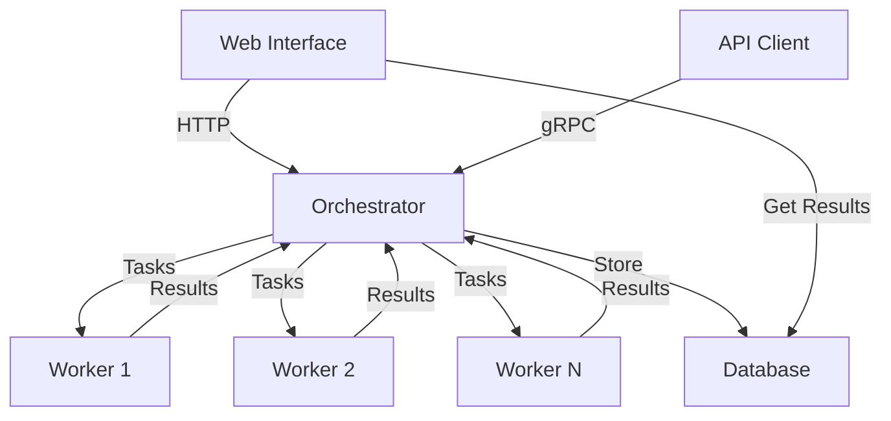

# gRPCCalculator

## 📌 Описание

Сервер для обработки математических выражений (поддерживает цифры и операции `+`, `-`, `*`, `/`). Включает:

- gRPC и REST API
- Web-интерфейс
- Систему аутентификации

Приложение преобразует выражения в обратную польскую нотацию (RPN), разбивает на задачи и распределяет их между воркерами.

Контакт: [@OnYyon](https://t.me/OnYyon)

---

## 🏗 Архитектура приложения



### Компоненты:

- **Web Interface** — пользовательский интерфейс (`порт 8081`)
- **Orchestrator** — ядро системы (`порт 8080`)
  - Принимает выражения
  - Преобразует в RPN
  - Разбивает на задачи
  - Управляет воркерами
- **Workers** — вычислительные узлы
- **Database** — хранилище выражений и результатов

---

## 🚀 Установка и запуск

- **Docker** или **Go 1.24+**

### 🔧 Запуск

#### 1. Через Docker Compose (рекомендуется)

```bash
git clone https://github.com/OnYyon/gRPCCalculator.git
cd gRPCCalculator
docker-compose up --build
```
При **повторном** запуске просто воспользуйтесь<br>
Только тогда отсануться данные в бд
```bash
docker-compose up
```
#### 2. Вручную (три терминала)

```bash
# Терминал 1 - Оркестратор
go run cmd/orchestrator/main.go

# Терминал 2 - Воркер
go run cmd/worker/main.go

# Терминал 3 - Веб-интерфейс
go run web/main.go
```

После запуска откройте Web Interface на [`http://localhost:8081`](http://localhost:8081)

---

## Использование
1. Зарегестрируйтесь<br>
    1.1 Если возникла ошибка `Registration failed`, то такой пользователь уже созан
2. Залогинтесь
3. И можете добавлять выражения во вкладке `calculate`
4. Просматрировать свои выражения во вкладке `expressions`

---

## ⚙️ Как это работает

### Процесс обработки выражения:

1. Пользователь отправляет выражение (через web или API)
2. Оркестратор:
   - Проверяет аутентификацию
   - Преобразует в RPN
   - Разбивает на атомарные задачи
3. Воркеры вычисляют части выражения
4. Результаты собираются и возвращаются

### 🧩 Пример: `1 + (2 + 3) + (4 + 5) + (6 + 7) + (4 * 3 / 8)`

- **RPN:** `1 2 3 + + 4 5 + + 6 7 + + 4 3 * 8 / +`
- **Задачи (параллельно):**
  - `2 3 + → 5`
  - `4 5 + → 9`
  - `6 7 + → 13`
  - `4 3 * → 12`
- **Результат (последовательно):**
  - `1 5 + → 6`
  - `6 9 + → 15`
  - `15 13 + → 28`
  - `12 8 / → 1.5`
  - `28 1.5 + → 29.5`

---

## 🔌 API Примеры

### Регистрация

```bash
curl -X POST http://localhost:8080/api/register   -H "Content-Type: application/json"   -d '{"login": "user", "password": "pass"}'
```

### Авторизация

```bash
LOGIN_RESPONSE=$(curl -s -X POST http://localhost:8080/api/login   -H "Content-Type: application/json"   -d '{"login": "user", "password": "pass"}')
TOKEN=$(echo $LOGIN_RESPONSE | jq -r '.token')
```
### Невераня аторизация
```bash
curl -X POST http://localhost:8080/api/register \
  -H "Content-Type: application/json" \
  -d '{"login": "", "password": "123"}'
```
```bash
curl -X POST http://localhost:8080/api/login \
  -H "Content-Type: application/json" \
  -d '{"login": "user", "password": "wrongpass"}'
```

### Отправка выражения

```bash
curl -X POST http://localhost:8080/api/expression   -H "Authorization: Bearer $TOKEN"   -H "Content-Type: application/json"   -d '{"expression": "2 + 2 * 2"}'
```

### Получение результатов

```bash
# Все выражения
curl -X GET http://localhost:8080/api/expressions   -H "Authorization: Bearer $TOKEN"

# Конкретное выражение
curl -X GET "http://localhost:8080/api/expression/1"   -H "Authorization: Bearer $TOKEN"
```

---

## 🧪 Тестирование

Перед запуском тестов **удалите файл БД**:
Это нужно так как тесты создаю одного и тоже пользователя. При повтороном запкске будет ошибка, что пользователь уже есть

```bash
go test ./tests -v
```

---

## ⚙️ Настройки окружения

| Переменная         | Значение по умолчанию | Описание                         |
|--------------------|------------------------|----------------------------------|
| `COMPUTING_POWER`  | 13                     | Количество воркеров              |
| `ORCHESTRATOR_PORT`| 8080                   | Порт оркестратора                |
| `WEB_PORT`         | 8081                   | Порт веб-интерфейса              |

---
